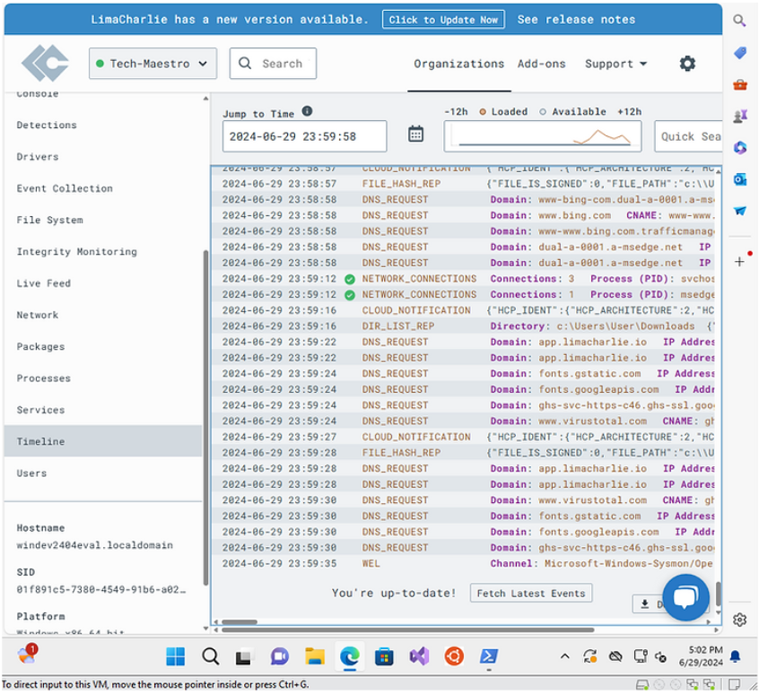
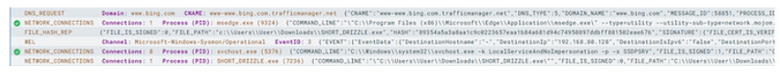
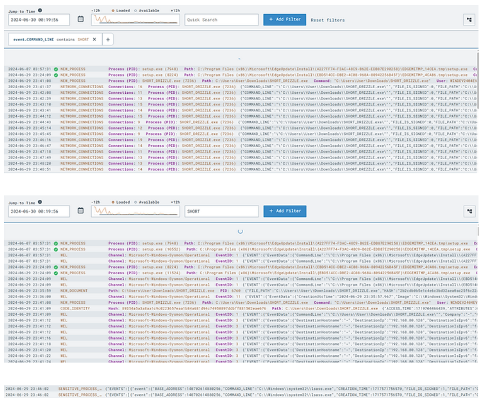
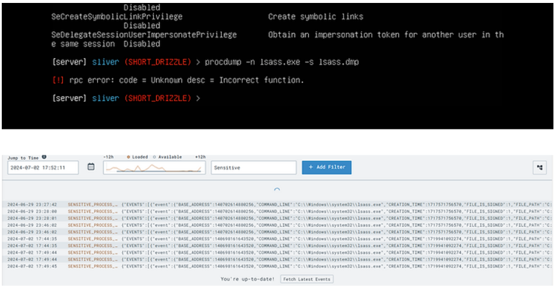
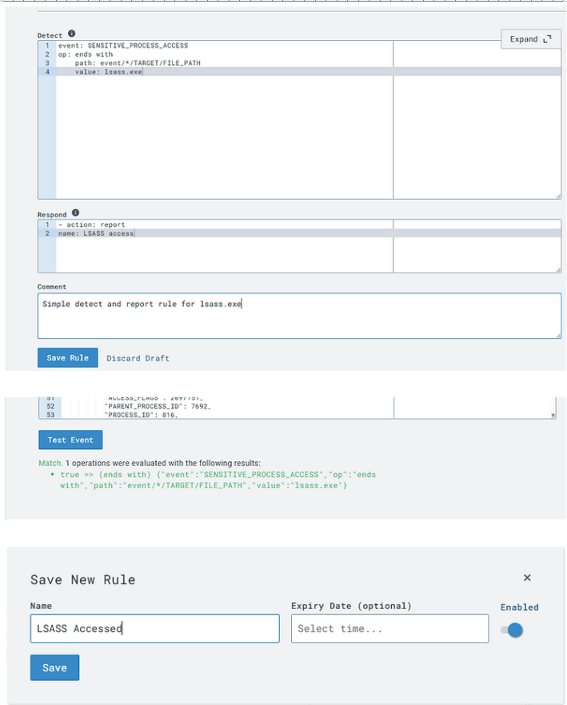
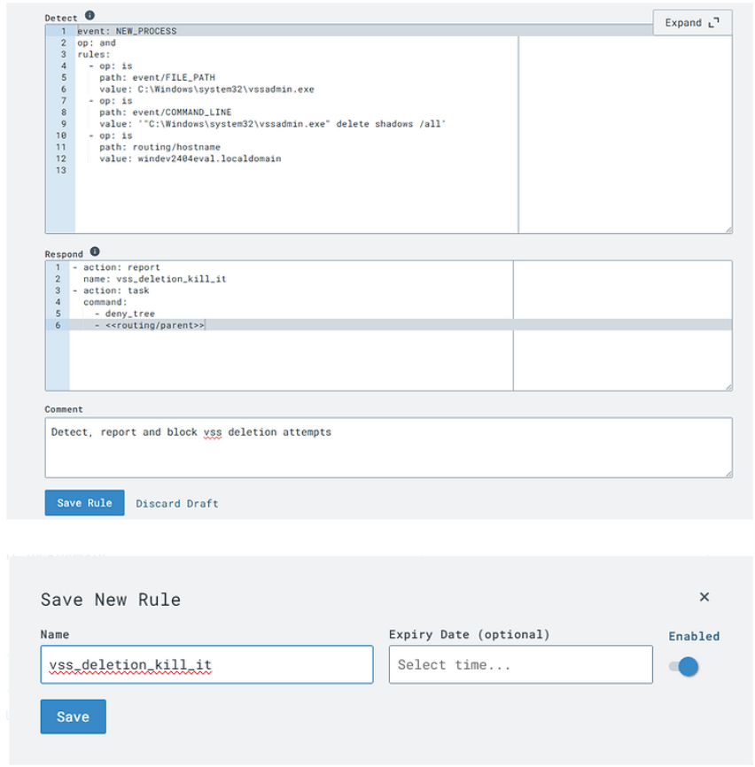
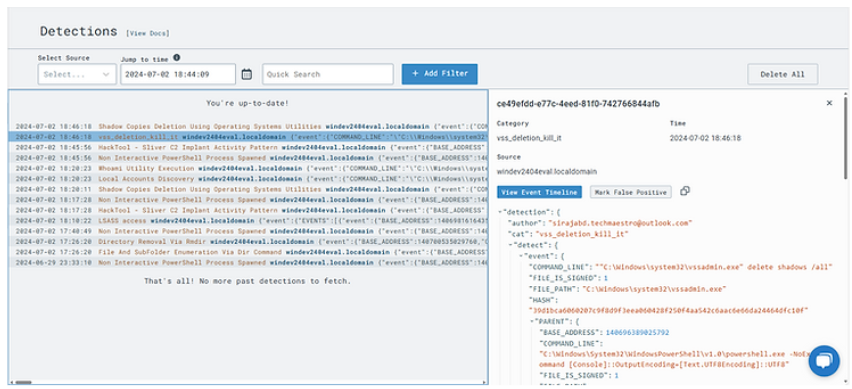

# 🛡️ Generating and Managing EDR

**Author:** Siraj Abdul-Shahid  
**Date:** 07/04/2024  

---

## 📘 Introduction

In the world of cybersecurity, mastering the art of safeguarding digital assets requires hands-on experience. This lab project focuses on building practical skills in a home lab environment by simulating threats and learning how to detect and respond using endpoint detection and response (EDR) tools.

My home lab was used to generate telemetry, simulate attacks, and build detection strategies using tools like **LimaCharlie** and **Sliver**. The following document details key techniques, actions, and lessons from this hands-on project.

---

## 📡 Monitoring and Detection

### Telemetry and Event Log Analysis
- Initiated monitoring of telemetry and event logs within **LimaCharlie** to understand system activity.
- Observed events that had been previously generated using a **C2 server** setup.
  
 

### Inspecting Hashes with VirusTotal
- Checked file hashes on VirusTotal.
- In cases where no results were returned, used this as a learning opportunity to better understand **custom-generated payloads**.

### LimaCharlie Timeline Analysis
- Used LimaCharlie’s **Timeline** feature to view real-time telemetry and event logs.
- Practiced filtering events to locate suspicious or interesting activity.
- Supplemented learning with resources from:
  - [sans.org](https://www.sans.org)
  - [cisa.gov](https://www.cisa.gov)
  - LimaCharlie documentation

### Unsigned Network Connections
- Detected and reviewed unsigned or unusual network connections as potential **indicators of compromise**.

### Privilege Check Events
- Investigated privilege elevation and location creation events for abnormal access attempts.

---

## ⚔️ Detection and Response Strategies

### Procdump Attack Simulation
- Simulated **LSASS dumping** using `procdump` via Sliver.

  
- Studied Microsoft's documentation on the implications and methods of detecting this attack.
- Generated telemetry during the dump process for later analysis in LimaCharlie.

### Creating Detection and Response (D&R) Rules
- Crafted a detection rule targeting sensitive process access, specifically interactions with **lsass.exe**.
- Refined rules by filtering for victim/target processes ending in `lsass.exe`.
- Re-executed `procdump` to validate detection rule functionality.
- Successfully triggered detection in LimaCharlie under the “Detections” panel.

  

### Using Sliver for Remote Command Execution
- Ran commands from a **Linux VM** targeting the **Windows VM** using Sliver.
- Used this setup to simulate attacker behavior and verify alerting based on custom detection rules.

### Blocking Attacks
- Created and tested a rule to block **volume shadow copy deletion**, a behavior common in ransomware activity.

  
- Simulated the attack to confirm the rule effectively blocked the event and generated a response.

  

---

## 📚 Supplemental Reading
- [Microsoft Blog: LSASS Dumping](https://techcommunity.microsoft.com/t5/microsoft-defender-for-endpoint/behind-the-scenes-of-lsass-dump-and-mde-detection/ba-p/3121738)
- [YARA Documentation](https://yara.readthedocs.io/en/stable/)
- [LimaCharlie Documentation](https://docs.limacharlie.io)

---

## 🧠 Conclusion

This lab reinforced the importance of **monitoring**, **telemetry analysis**, and **custom detection rule creation**. By leveraging LimaCharlie and Sliver, I was able to simulate real-world attacks, test my detection logic, and begin tuning false positives for more accurate results.

I plan to continue practicing with different attacks and refining my detection strategies over time.

---
